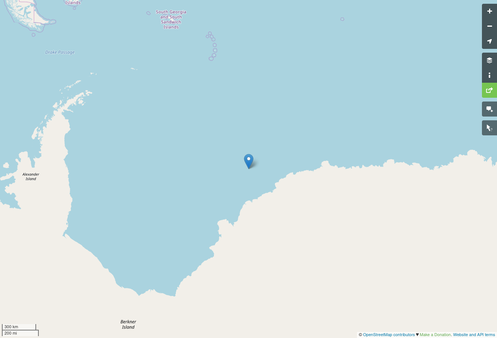
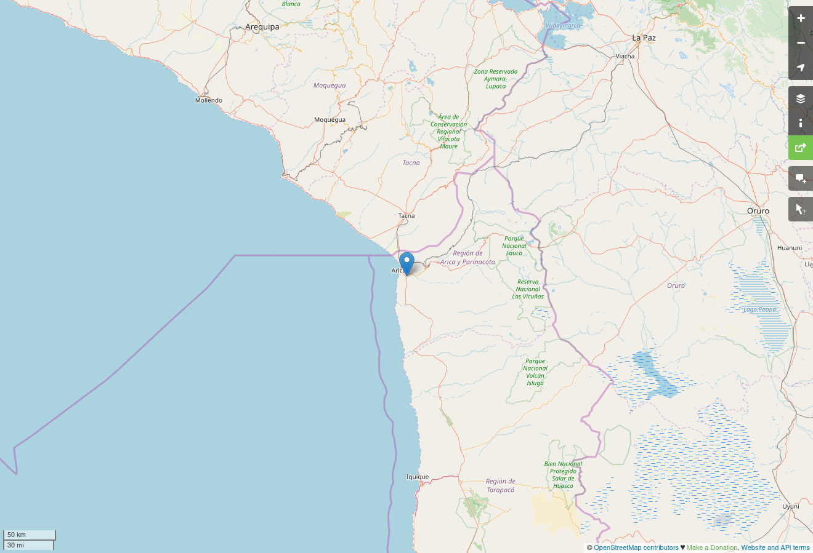
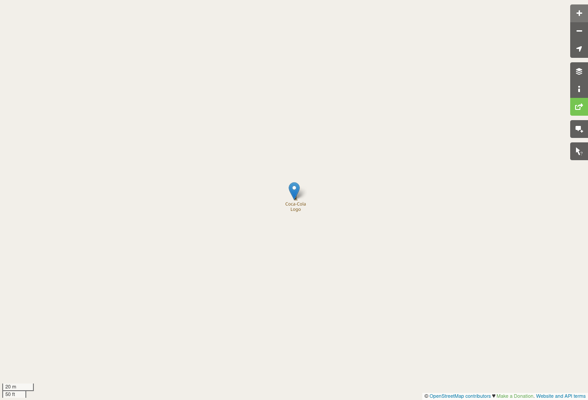

# Geography
__Category__: Misc  
__Points__: ~317
>My friend told me that she found something cool on the Internet,
>but all she sent me was 11000010100011000111111111101110 and
>11000001100101000011101111011111.
>
>She's always been a bit cryptic. She told me to "surround with 
>gigem{} that which can be seen from a bird's eye view"... what?

Since two numbers are given and the challenge is about geography  
it can be deduced that those numbers represent coordinates.   
Latitude und longitude normally are numbers with at least one   
decimal place so the bitstrings are single precision floating point values.

[cord.c](cord.c) takes those bitstrings and converts them into human-readable form:
```
-70.249863 -18.529234
```  
  
Entering those into [OpenStreetMap](https://www.openstreetmap.org/search?query=-70.249863%20-18.529234#map=6/-70.250/-18.529) unfortunately yielded nothing at first:


But after swapping the coordinates to
```
-18.529234 -70.249863
```
you get a [better result](https://www.openstreetmap.org/search?query=-18.529234%2C-70.249863):


The task says that something can be seen from a birds eye view but nothing can be seen yet. You have to zoom in very closely until you can see the following:


It says "Coca-Cola Logo" and the flag is
```
gigem{CocaCola}
```
