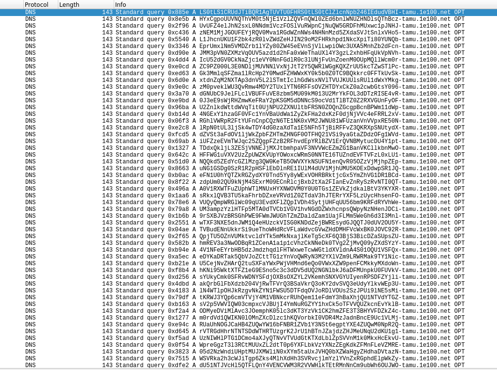
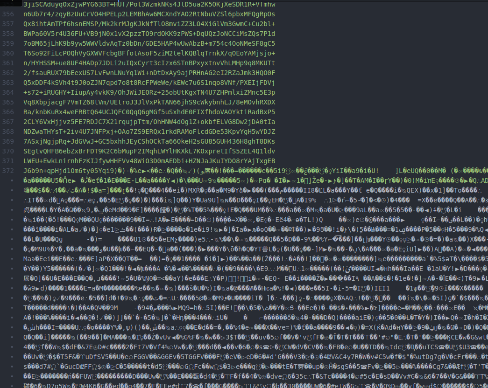
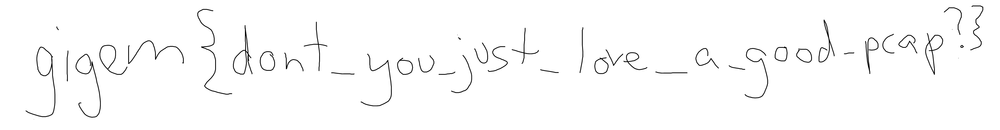

# Russian Nesting Doll
__Category__: Misc   
__Points__: ~424   
>Our monitoring systems noticed some funny-looking DNS traffic on one   
>of our computers. We have the network logs from around the time of   
>the incident. Want to take a look?
>
> Attachement: [netlogs.pcap](./netlogs.pcap)

This challenge actually was a pain in the ass.  
You can break the pcap down into two parts:
1. 38,120 DNS requests
2. Some FTP communication

The FTP communication is basically transferring a gpg [public-key](./pub.asc)  
and [private-key](./priv.asc) which belong to `Ol' Rock <olrock@aggie.network>`.

#### Stage 0 and stage 1
The DNS requests are all very similar. They consist of 58 base64 chars ending with `-tamu.1e100.net`.



If we try to decode the base64 part of the first request we get:
```
$ echo LS0tLS1CRUdJTiBQR1AgTUVTU0FHRS0tLS0tClZlcnNpb246IEdudVBHI | base64 -d 2>/dev/null
-----BEGIN PGP MESSAGE-----
Version: GnuPG
```

So we can see that the base64 transmitted via the queries contains a GPG message.
Using a [script](./parse.py) we can extracts all DNS requests from the pcap
and save the base64 part to disk (one line in this file equals one packet from the pcap file). After decoding this it looks like we got a valid gpg message except for the following part:

So obviously something went wrong. Looking deeper into this we can see that the first line of the base64 input that converts to non-printable characters is a duplicate of the previous line.
If we remove all duplicate lines from the file we get a valid gpg message (stage 1).

#### Stage 2
We can decrypt this with the keys we extracted previously and we get a gzip file.   
The password is the same password used in the FTP communication: `howdy`.

#### Stage 3
Unzipping the gzip file yields a tar file.

#### Stage 4
Extracting that tar archive yields 10 files ("...encoded", "....encoded", ".....encoded", ...).
Running `file` over everything shows that 9/10 are garbage but one is a JPEG image.

```
$ file .*enc*
............encoded: ASCII text
...........encoded:  ASCII text
..........encoded:   ASCII text
.........encoded:    ASCII text
........encoded:     JPEG image data, JFIF standard 1.02, aspect ratio, density 100x100, segment length 16, progressive, precision 8, 909x663, components 3
.......encoded:      ASCII text
......encoded:       ASCII text
.....encoded:        ASCII text
....encoded:         ASCII text
...encoded:          ASCII text
```

#### Stage 5
The jpeg looks like this:

And we can see this at the end of the file:
```
0001c5c0: 0000 0000 0000 0000 0000 6831 8160 0000  ..........h1.`..
0001c5d0: 0000 0000 0000 0000 6831 8160 0000 0000  ........h1.`....
0001c5e0: 0000 0000 0000 6831 8160 0000 0000 0000  ......h1.`......
0001c5f0: 0000 0000 6831 8160 0000 0000 0000 0000  ....h1.`........
0001c600: 0000 6831 8160 0000 0000 0000 0000 0000  ..h1.`..........
0001c610: 6831 8160 0000 0000 0000 0000 0000 6831  h1.`..........h1
0001c620: 8160 0000 0000 0000 0000 0000 6831 8160  .`..........h1.`
0001c630: 0000 0000 0000 0000 0000 68ad 7ffe f91f  ..........h.....
0001c640: 6b47 4377 8903 9bdb 0000 0000 4945 4e44  kGCw........IEND
0001c650: ae42 6082                                .B`.
```
At the end of the JPEG image we find an end of an PNG image ("IEND").   
Also binwalk tells us that there are actually two images in this file (the zlib compressed data probably belongs to the PNG image):
```
DECIMAL       HEXADECIMAL     DESCRIPTION
--------------------------------------------------------------------------------
0             0x0             JPEG image data, JFIF standard 1.02
58784         0xE5A0          PNG image, 3760 x 492, 8-bit/color RGB, non-interlaced
58875         0xE5FB          Zlib compressed data, compressed
```

#### Stage 6
After extracting the PNG image from [stage5.jpg](./stage5.jpg) into [stage6.png](./stage6.png)
we can finally see the flag:

